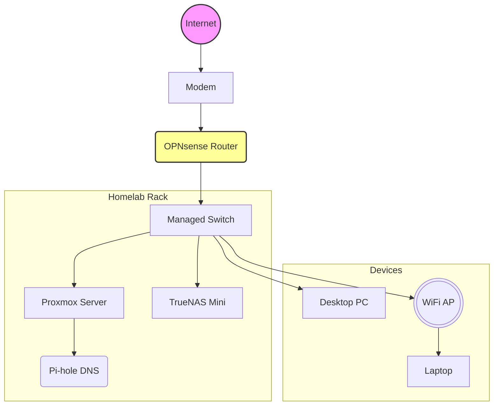

# This is a test to see if the build has worked!
Here is my basic homelab setup:

```mermaid
graph TD
    Internet((Internet)) --> Modem
    Modem --> Router(OPNsense Router)
    Router --> Switch[Managed Switch]
    
    subgraph "Homelab Rack"
        Switch --> Proxmox1[Proxmox Server]
        Switch --> NAS[TrueNAS Mini]
        Proxmox1 --> PiHole(Pi-hole DNS)
    end

    subgraph "Devices"
        Switch --> PC[Desktop PC]
        Switch --> WiFiAP(((WiFi AP))) --> Laptop
    end

    style Internet fill:#f9f,stroke:#333,stroke-width:2px
    style Router fill:#ff9,stroke:#333,stroke-width:2px
    
```

